# Style-Transfer

Pytorch implementation of Style Transfer method described in the ["Image Style Transfer Using Convolutional Neural Networks"](https://www.cv-foundation.org/openaccess/content_cvpr_2016/papers/Gatys_Image_Style_Transfer_CVPR_2016_paper.pdf)  paper by Gatys, Ecker & Bethge.

- Quickly Getting Started, checkout [How To Use](#how-to-use) 
- Style Transfer between your local images or online images (using image urls) on Google Colab, checkout this [notebook](style_transfer_colab_demo.ipynb)
- Learn More About [Style Transfer](#how-does-style-transfer-work)
- Check Out some style transfer results [here](#demo)


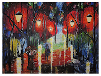
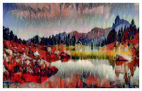

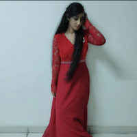
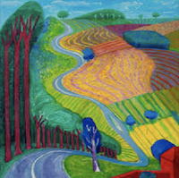
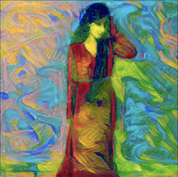


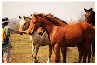
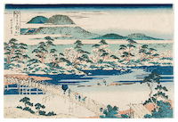
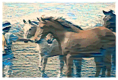

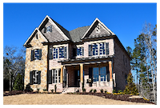
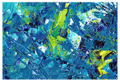
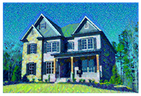


# How to Use
***You can give Image URLs or Local Path for content url & style url***

### Use From Terminal

If these arguments aren't provided then script will pick two random images from demo imgs and run style transfer.

```
$ python transfer.py --content_url CONTENT_URL --style_url STYLE_URL --steps STEPS 
```

### Access as Module in Python

```
>>> from style_transfer import style_transfer
>>> style_transfer(content_url='imgs/content3.jpg', style_url='imgs/style4.jpg', steps=4000)
```
### Parameters
If conent & style url aren't given, then script will pick two random images from demo imgs.

``` 
- content_url=CONTENT_URL;          Path/URL of Content Image
- style_url=STYLE_URL;               Path/URL of Style Image
- output_file='output/output.jpg';   Filename for the output file
- ngpu=1;                            Number of GPUs to use
- content_weight=1;                  Alpha value, the weight of content image in style transfer
- style_weight=1e6;                  Beta value, the weight of style image in style transfer
- save_every=400;                    How often should the target image be saved
- make_new=False;                    If true, every time target image will be saved as a new file, without replacing the previously saved target image
- steps=2000;                        Total Number of Steps for editing target image

```

# How Does Style Transfer Work?
Style Transfer works by combining features of style image and content image into a target image. Content image gives shapes and organization of the image while style image provides colors, textures and style. 

In this implementation, I have used a pre-trained VGG19 for feature extraction. Initial layers of CNN generally extract overall features like colors and textures, while later layers extract more refined features like shapes and object arragments. 

Content loss & style loss are defined by MSE between Gram matrix of features of target image and content/style image.

Style Transfer is done by minimizing the total loss (combination of both content loss and style loss). This combination of two losses dicates the style/content of target image. If during combination, content loss has higher weight then target image will be much more like content image. On the other hand if style loss has higher weight then target image will be much more like style image. Depending on need, these weights should be assigned. By default content weight=1 & style_weight=1e6

# Demo


# References
- Image Style Transfer Using Convolutional Neural Networks paper by Gatys, Ecker & Bethge.
